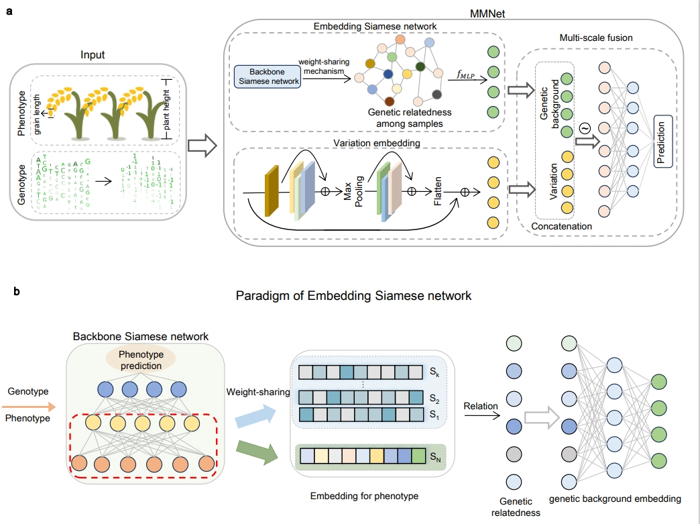

### MMNet

MMNet is a mixed model-based deep neural network architecture for genomic selection. This repository includes model deployment, training steps, prediction steps, and model parameter settings.




### Set up

Set up environments using the following command:

```python
conda create -n MMNet python=3.9.17
conda activate MMNet
conda install pytorch==2.0.0 torchvision==0.15.0 torchaudio==2.0.0 pytorch-cuda=11.8 -c pytorch -c nvidia
pip install -r requirements.txt 
```

### Data Preparation

- The genotype data and phenotype datasets should be in a data folder, organizing as follows:

  ```python
  + data
      ++ Genotype.csv
      ++ phenotype.csv
      + train_val_test
  ```

- To generate training samples, validation samples and test samples, using the following command:

  ```python
  cd MMNet
  python generate_train_val_test_ids.py
  ```

### Embedding Siamese to generate genetic relatedness

- To generate the genetic relatedness , use the following command. The model's dropout rate is set to `p`, and after training for `epoch` iterations, the genetic_relatedness is constructed.

  ```python
  python generate_genetic_relatedness.py [parameters]
  
  [parameters]:
      --epoch   # Number of iterations
      --p       # Dropout rate
      --genotype_path   # Path to the genotype data file (CSV format)
      --phenotype_path  # Path to the phenotype data file (CSV format)
      --train_val_ids_path  # Path to the directory containing training, validation, and test set indices
      --batch_size      # Number of samples per batch during training
      --lr      # Initial learning rate for the optimizer
      --weight_decay    # L2 regularization strength to prevent overfitting
      --factor  # Factor by which the learning rate is reduced when performance plateaus
      --patience    # Number of consecutive epochs without improvement before reducing the learning rate
      --genetic_relatedness_path    # Path to save the generated genetic relatedness
      --windows_mechanism   # Windows mechanism 0: don't use windows_mechanism, 1: windows_mechanism by chromosome
      --windows_chr   # the number of chromosomes in a window
  ```
  
  Although we provide recommended [parameter settings](save/parameter_to_generate_genetic_relatedness.md), considering differences in hardware, users are advised to carefully determine these parameters based on error variations during training. The constructed genetic_relatedness will have a significant impact on the prediction performance of MMNet.


### Train MMNet and analyze the contribution between VE and ESN

- To train MMNet and evaluate it on the test set, the number of training epochs is set to `epoch`. To ensure evaluation stability, the average prediction performance of the top `k` models with the best validation results is used. The following command will also output the contribution variations of the VE and ESN modules during the training process, with the results saved in the `result` folder.

  ```python
  python train.py [parameters]
  
  [parameters]:
      --genetic_relatedness_epoch   # The epoch number used to generate and save the genetic relatedness
      --epoch	# Number of iterations
      --p_ve_upper # The dropout rate for the upper branch of the VE
      --p_ve_lower # The dropout rate for the lower branch of the VE 
      --p_genetic_relatedness       # The dropout rate for the ESN 
      --p_fusion    # The dropout rate for the Fusion module
      --k 	 # The number of top-performing models (based on validation performance) to average for evaluation
      --stride      # The stride for the first convolutional layer in the upper branch of the VE
      --genotype_path  # Path to the genotype data file (CSV format)
      --genetic_relatedness_path    # Path to the generated genetic relatedness
      --phenotype_path  # Path to the phenotype data file (CSV format)
      --train_val_ids_path # Path to the directory containing training, validation, and test set indices
      --batch_size  # Number of samples per batch during training
      --lr  # Initial learning rate for the optimizer
      --weight_decay    # L2 regularization strength to prevent overfitting
      --factor   # Factor by which the learning rate is reduced when performance plateaus
      --patience # Number of consecutive epochs without improvement before reducing the learning rate
      --monitor  # The metric to monitor ("train_loss"or "val_loss")
      --windows_mechanism   # Windows mechanism 0: don't use windows_mechanism, 1: windows_mechanism by chromosome
      --windows_chr   # the number of chromosomes in a window
  ```

​	Although we provide recommended [parameter settings](save/parameter_to_train_MMNet.md), considering differences in hardware, users are advised to carefully determine these parameters based on error variations during training. 

​	**Tips:** Different stride parameter values, when combined with different Genotype files, result in varying data dimensions. Please adjust the parameters in the upper branch of the VE module `(models/*/ve_embedding.py)` according to the actual situation.

### Acknowledgements

This work is based on [pytorch](https://pytorch.org/) ,  [scikit-learn](https://scikit-learn.org/),  and [plink](https://www.cog-genomics.org/plink/). The project is developed by following author(s) and supervised by Prof. Xiangchao Gan(gan@njau.edu.cn)

Authors:

Yanhui Li  (huiyl@stu.njau.edu.cn): prototype development, data processing, model validation 

Shengjie Ren (sunflower@stu.njau.edu.cn): overall frame work, model construction, model optimization,  contribution analysis

