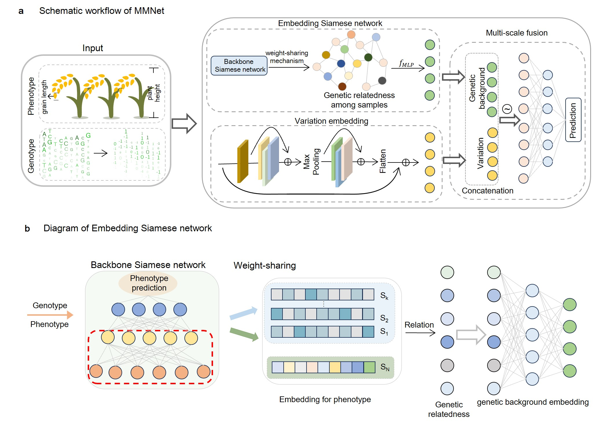

### MMNet

MMNet is a mixed model-based deep neural network architecture for multi-environment agronomic traits prediction. This repository includes model deployment, training steps, prediction steps, and model parameter settings.



### Set up

Set up environments using the following command:

```python
conda create -n MMNet python=3.9.17
conda activate MMNet
conda install pytorch==2.0.0 torchvision==0.15.0 torchaudio==2.0.0 pytorch-cuda=11.8 -c pytorch -c nvidia
pip install -r requirements.txt 
```

### Data Preparation

- The genotype data and phenotype datasets should be in a data folder, organizing as follows:

  ```python
  + data
      + gene
      	++ genotype.csv
      + phen 
       	++ phenotype.csv
      + splits
  ```

- To generate training samples, validation samples and test samples, using the following command:

  ```python
  cd MMNet
  python utils/process_data/split.py
  ```


### Embedding Siamese to generate genetic relatedness

- To generate genetic relatedness, train the backbone of the Siamese network. The resulting genetic relatedness is then saved in `saved/genetic_relatedness.csv`.

  ```python
  python generate_genetic_relatedness.py [parameters]
  
  [parameters]:
      --phenotype  # Phenotype name
      --windows_mechanism   # Windows mechanism 0: don't use windows_mechanism, 1: windows_mechanism by chromosome
      --windows_chr   # Number of chromosomes in a window
      --device	# Device: cuda or cpu
  ```

  Although we provide recommended [parameter settings](configs/ESN.json), considering differences in hardware, users are advised to carefully determine these parameters based on error variations during training. The constructed genetic relatedness will have a significant impact on the prediction performance of MMNet.


### Train MMNet and analyze the contribution between VE and ESN

- To train the MMNet model and evaluate the contributions of the VE and ESN modules, use the following command. The error tracking results during training and the contributions of the VE and ESN modules will be saved in `mmnet.log`

  ```python
  python train_mmnet.py [parameters] > mmnet.log 
  
  [parameters]:
      --phenotype  # Phenotype name
      --windows_mechanism   # Windows mechanism 0: don't use windows_mechanism, 1: windows_mechanism by chromosome
      --windows_chr   # Number of chromosomes in a window
      --device	# Device: cuda or cpu
  ```

​	Although we provide recommended [parameter settings](configs/MMNet.json), considering differences in hardware, users are advised to carefully determine these parameters based on loss during training. 


### Acknowledgements

This work is based on [pytorch](https://pytorch.org/) ,  [scikit-learn](https://scikit-learn.org/),  and [plink](https://www.cog-genomics.org/plink/). The project is developed by following author(s) and supervised by Prof. Xiangchao Gan(gan@njau.edu.cn)

Authors:

Yanhui Li  (huiyl@stu.njau.edu.cn): prototype development, data processing, model validation 

Shengjie Ren (sunflower@stu.njau.edu.cn): overall frame work, model construction, model optimization,  contribution analysis

